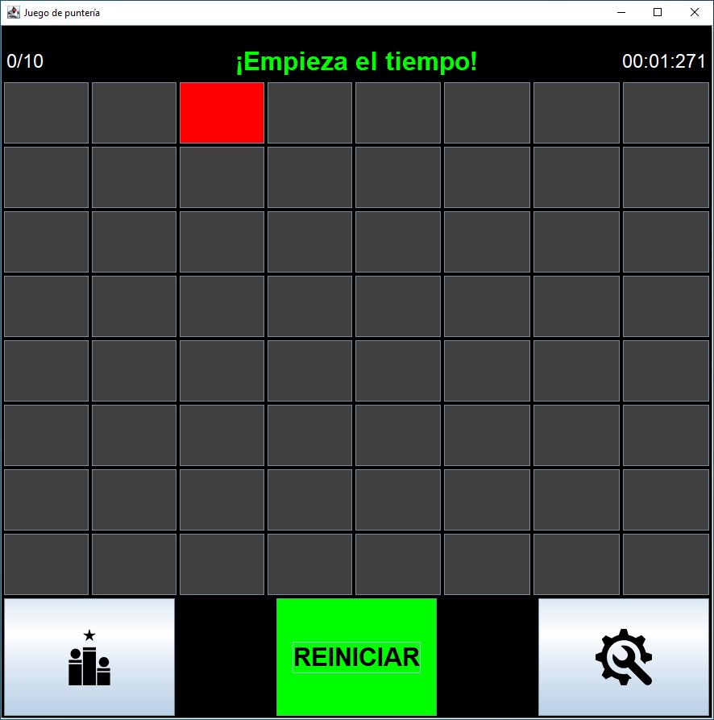

# Descripción

El **JUEGO DE PUNTERÍA** se ha desarrollado en Java utilizando la biblioteca Swing para la interfaz gráfica de usuario. El objetivo del juego es seleccionar la casilla roja que aparecerá en una posición aleatoria en cada ronda en el menor tiempo posible, ayudandote a mejorar tu precisión y velocidad de reacción.

## Cómo ejecutar el juego

1. Clona o descarga el repositorio en tu máquina local.
2. Abre el proyecto en tu IDE.
3. Compila y ejecuta el archivo `Principal.java`.
4. El juego se abrirá en una ventana separada.

## Características del juego

- El juego consta de un tablero de 8x8 casillas.
- En cada ronda, una casilla se resaltará en color rojo.
- Tu objetivo es seleccionar la casilla roja en el **menor tiempo posible** haciendo clic en ella.
- Si seleccionas la casilla correcta, recibirás un mensaje de "¡ACIERTO!" y pasarás a la siguiente ronda.
- Si seleccionas una casilla incorrecta, recibirás un mensaje de "FALLO" y podrás intentarlo nuevamente.
- El juego continúa hasta que hayas completado todas las rondas configuradas.
- Al finalizar, se te pedirá que ingreses un nombre para guardar tus estadísticas en un archivo XML.

## Personalización del juego

La configuración del juego te permite ajustar el número de rondas. Por defecto, el juego se configura para 10 rondas. Sin embargo, puedes incrementar o disminuir el número de rondas utilizando los botones "+" y "-".

## Historial de partidas

El juego guarda las estadísticas de las partidas en un archivo XML. Puedes acceder al historial de partidas seleccionando la opción "Historial" en la interfaz del juego.

